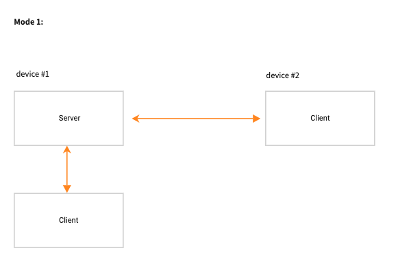
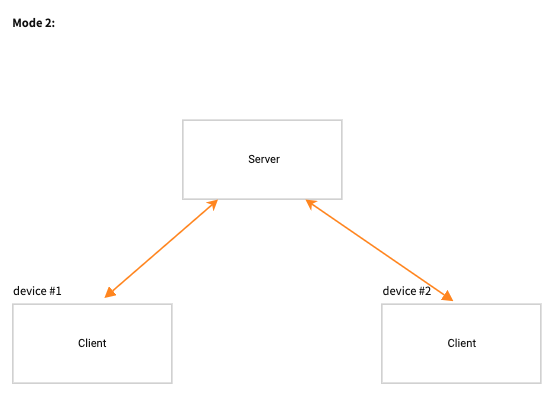

<p align="center">
  
  <p align="center">Share your clipboard. Text, Screenshot, File are supported.</p>
</p>

---

[中文文档](docs/intro.md)

A clipboard synchronization tool that powered by Golang.

This is a tool to synchronize clipboards between different operating systems.

`Text`, `Screenshot` & `File` are supported.


## Usage

GCopy has two modes, the first mode is more easy to use:

### server&client <> clients

This mode requires one device to simultaneously act as both the server and client. These devices must be on the same LAN and should be able to access each other.

If you have two device, they are in the same LAN.

On first device:

```
/path/to/gcopy --role=server,client
```

On the other devices:

```
/path/to/gcopy --role=client --token=<output-token> --server=<server-ip>:3375
```



### clients <> server <> clients

In this mode, it is more flexible but requires a minimum of three devices, with one of them serving as the server. Clients do not need to be able to access each other, but it is required that clients can access the server.

On server:

```
$ /path/to/gcopy --role=server

  __ _  ___ ___  _ __  _   _ 
 / _  |/ __/ _ \| '_ \| | | |
| (_| | (_| (_) | |_) | |_| |
 \__, |\___\___/| .__/ \__, |
  __/ |         | |     __/ |
 |___/          |_|    |___/ 


The Server has started, start the clients:
/path/to/gcopy --role=client --server=192.168.137.146:3375 --token=helloworld
...
```

The Clients' command will be printed in the outputs. Run them on the Clients.




## Read more

- [The work mechanism](docs/mechanism.md)

## Limitations

- Only tested on windows 10 & macOS Monterey 
- It can only synchronize one file at a time

## Community

You have questions, need support or just want to talk about GCopy?

Here are ways to get in touch with the community:

Email: qustwwy@163.com

Wechat:

