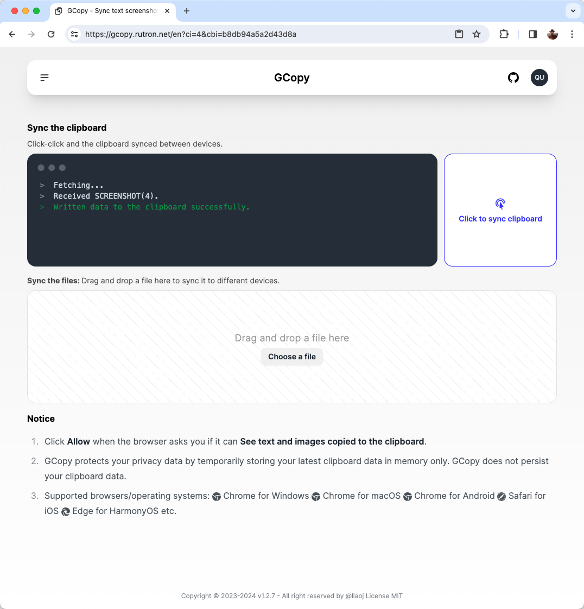
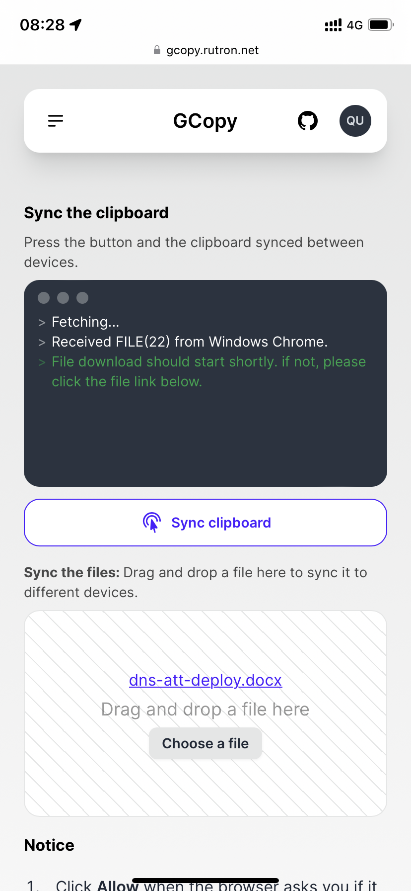

  
  
Share your clipboard. Text, Screenshot, File are supported.

---

[中文文档](docs/zh-CN/README.md)

A clipboard synchronization service between different operating systems.

`Text`, `Screenshot` & `File` are supported.

GCopy values your data privacy, it does not persistently store your data; it is all kept in memory. If you are inactive for 24h, the data will expire.

## Usage

Steps:

1. Open the website [https://gcopy.rutron.net](https://gcopy.rutron.net) on two devices, A and B, using a browser and log in with the same email.
2. On device A, copy (e.g., `Ctrl+C`) and then press the button on the right side of the page.
3. Switch to device B, press the button again, and the data will be synchronized. Now, go ahead and paste (`Ctrl+V`)!

## Background

In our daily office routines, especially for software developers, we often find ourselves working with more than two computers.

If you need to operate both a Windows PC and a MacOS device simultaneously, exchanging information between these two devices becomes quite troublesome. For various reasons, I couldn't find a good tool to share the clipboard between devices with different operating systems. When I copy a piece of text, pasting it on another computer usually proves to be quite challenging.

Current tools typically only support text, excluding screenshots and files. Additionally, they often require devices to be on the same local network and accessible to each other, not to mention some of them come with a fee.

This is not ideal!

Therefore, I developed GCopy to address these issues. Currently, you can share the clipboard across PC, Mac, and mobile devices, supporting text, screenshots, and files. It has low network requirements, allowing different devices to be on the same local network or not.

Initially, I used Git as the backend storage and utilized scripts like PowerShell and osascript to synchronize the clipboard between different devices. However, due to its dependence on Git, it was not user-friendly for non-technical users. So, I replaced Git with Golang to serve as a data transfer service between different devices, but it still required users to download and run the GCopy client on their devices, creating a barrier to entry. That led to the development of the current version, 'GCopy v1.0', as a web service. You can directly access the website [https://gcopy.rutron.net](https://gcopy.rutron.net) without worrying about data leakage.

## Browser compatibility

GCopy depends on the browser's Clipboard API. Please refer to [browser_compatibility](https://developer.mozilla.org/en-US/docs/Web/API/Clipboard#browser_compatibility) for more information.

The tested browsers and its versions are listed below:

|Browser|Version||
|-|-|-|
|Chrome for Windows|Version 123.0.6312.86 (Official Build) (x86_64)|✅ Tested|
|Edge for Windows 10|Version 124.0.2478.80 (Official build) (64-bit)|✅ Tested|
|Opera for Windows 10|Opera One(version: 109.0.5097.68)|✅ Tested|
|Chrome for macOS|Version 121.0.6167.85 (Official Build) (x86_64)|✅ Tested|
|Opera for macOS|Opera One(version: 109.0.5097.68) (x86_64)|✅ Tested|
|Safari|Version 15.6.1 (17613.3.9.1.16)|✅ Tested|
|Safari for iOS|Version 16.1|✅ Tested|
|Edge for HarmonyOS 3.0/4.0|Edge 122.0.2365.99|✅ Tested|
|Chrome for Android|107.0.5304.105|✅ Tested|
|Edge for Android|Edge 108.0.1462.48|✅ Tested|

## Limitations

- Due to browser limitations, reading and setting files directly in the clipboard are not supported. Therefore, file synchronization is achieved through uploading and downloading, ensuring a smooth user experience.
- At any given time, only one file can be synchronized.
- Due to limited server memory, the size of the files you synchronize must not exceed `--max-content-length` MB.

## Community

Welcome to join GCopy, whether you're a user or a contributor!

If you have any questions or need support related to GCopy, you can contact me through the following channels:

### Email

Feel free to reach out to my personal email: qustwwy@163.com. If you have any questions, you can drop me a message.

### Discord

Here, some interesting discussions are happening.

Server link: https://discord.gg/pyTrT3aAaC

## Screenshot

Safari on iOS

## More

- [Deploy by docker](/docs/deploy-by-docker.md)
- [Deploy from source code](./docs/deploy-from-source.md)