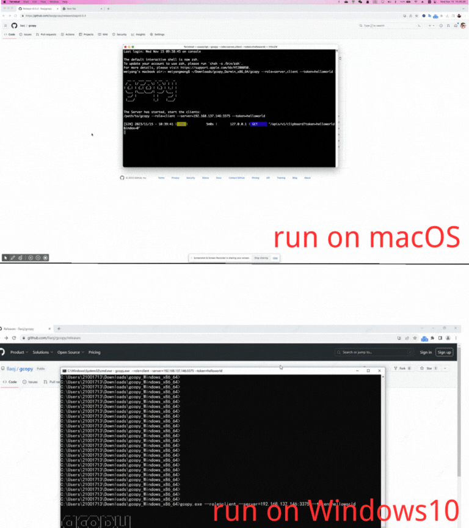

## 背景

在日常的办公中, 我们通常需要操作两台以上的电脑, 尤其是软件开发工程师.

假如, 你需要同时操作Windows电脑和MacOS电脑, 在这两个设备之间传递信息变得非常麻烦. 
因为很多原因, 我找不到一个非常好的工具能共享两个不同操作系统的设备的剪切板.
当我拷贝了一段文字, 我需要在另外一台电脑上粘贴, 这通常非常困难.

现在的工具通常只支持文字, 但是截图, 文件不支持. 而且, 他们通常要求设备必须要在同一个局域网, 可以互相访问.
他们往往收费.

这很不好!

所以, 我开发了GCopy, 它解决了这些问题.
目前, 你可以在Windows电脑与MacOS电脑之间共享剪切板, 支持文字, 截图和文件.
它对网络没有太高的要求, 不同的设备可以在同一个局域网, 也可以不在.



## 下载和安装

访问 https://github.com/llaoj/gcopy/releases

按照您的操作系统下载对应的压缩包. 可执行文件就在压缩包中, 解压就可以执行.

## 简单用法

使用它的方法非常简单, 你只需要运行一个命令. 让我们看看吧.

假如, 你有两台电脑, 一台电脑安装了Windows, 另外一台电脑安装了MacOS, 他们在同一个局域网中, 可以互相访问.

我们在MacOS启动GCopy, 它既是客户端也是服务端.

```
$ /path/to/gcopy.exe --role=server,client

  __ _  ___ ___  _ __  _   _ 
 / _  |/ __/ _ \| '_ \| | | |
| (_| | (_| (_) | |_) | |_| |
 \__, |\___\___/| .__/ \__, |
  __/ |         | |     __/ |
 |___/          |_|    |___/ 


The Server has started, start the clients:
/path/to/gcopy --role=client --server=192.168.137.186:3375 --token=51b2f5
...
```

可以看到GCopy已经启动, 并打印出了客户端启动命令.

我们在Windows上, 打开cmd/powershell并输入上面打印出的命令并执行. 你可能需要修改一下命令, 比如给可执行文件加上`.exe`后缀, 或者修改gcopy的路径.

**注意:** 客户端命令中出现的`--server=192.168.137.186:3375`是服务端监听的地址, 它是GCopy自动发现的您设备的IP地址, `3375`是GCopy工作的端口号. 如果他们不好使, 您可以在启动服务端的时候, 通过手动指定`--listen=<ip:port>`来自定义服务端监听的地址.

这样, 这两台设备的剪切板就可以共享了. 

试一试拷贝&粘贴吧!

## 高级用法

想像一下, 如果你的设备不在同一个局域网内, 他们之间不能互相连接.

这时, 你可能需要另一种启动方式.

首先我们需要一台服务器, 要求它是可以被你的设备访问的. 通常我们的服务器都是Linux操作系统, 我们需要在它上面启动GCopy的服务端.

```
$ /path/to/gcopy --role=server

  __ _  ___ ___  _ __  _   _ 
 / _  |/ __/ _ \| '_ \| | | |
| (_| | (_| (_) | |_) | |_| |
 \__, |\___\___/| .__/ \__, |
  __/ |         | |     __/ |
 |___/          |_|    |___/ 


The Server has started, start the clients:
/path/to/gcopy --role=client --server=47.198.199.100:3375 --token=51b2f5
...
```

当然如果你想使用容器启动服务端, 也可以:

```
$ docker run -d --restart=always \
      --name=gcopy-server \
      -p 3375:3375 \
      registry.cn-beijing.aliyuncs.com/llaoj/gcopy:v0.1.0 \
      --tls \
      --certFile="/path/to/cert.pem" \
      --keyFile="/path/to/key.pem"
```

服务端启动成功, 你可能需要一些配置, 比如后台执行, 开机启动等. 我们看到上面的命令打印出了客户端启动命令, 然后我们在不同的设备上运行这个命令就行啦!

## 使用说明

我们执行usage命令看一下:

```
/path/to/gcopy --help

  __ _  ___ ___  _ __  _   _ 
 / _  |/ __/ _ \| '_ \| | | |
| (_| | (_| (_) | |_) | |_| |
 \__, |\___\___/| .__/ \__, |
  __/ |         | |     __/ |
 |___/          |_|    |___/ 

Usage of gcopy:
  -debug
        Enable debug mode
  -listen string
        The server will listen this ip and port, format: [ip]:port (default ":3375")
  -role string
        Include: server/client/server,client (default "client")
  -server string
        The client will communicate with the server through this ip and port (default "127.0.0.1:3375")
  -token string
        Identity authentication between client and server
```

- `--listen` 服务端监听地址, 客户端会将该地址配置到`--server`中, 并通过这个地址与服务端交互. GCopy会自动探测当前服务器的IP地址. 通常使用自动发现的IP是好用的, 但如果它不好使, 您可能需要手动指定, 可以使用这个选项.
- `--token` 服务端和客户端之间身份认证的密钥, 服务端在启动的时候会自动生成, 如果想手动指定, 可以使用这个选项.
- `--debug` 开启调试模式获取更多日志.

## 最后

这个项目一直在我的电脑上运行, 目前稳定可用. 如果你想用或者有兴趣, 可以联系我一起探讨.

项目地址: https://github.com/llaoj/gcopy

创作不易, 请点Star支持下

邮箱: qustwwy@163.com

微信:

