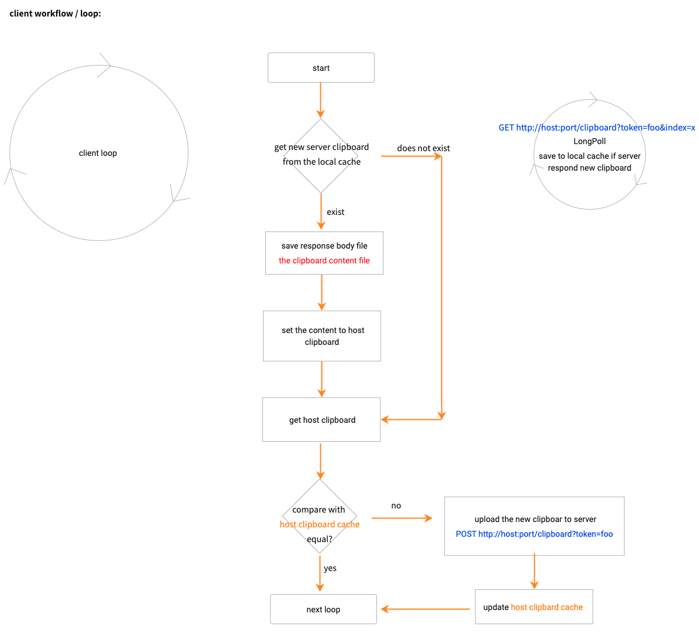
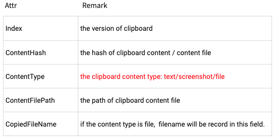

# The work mechanism



Client有个一直在运行的循环. 一次循环的工作内容参考上图.

开始, Client会调用`GET http://server-ip:port/apis/v1/clipboard?token=foo&index=x`接口获取Server最新的剪切板内容, url中的token是用于Client与Server之间身份验证的密钥, url中的index是Client.Clipboard的最新版本号, Client的版本号都是从Server获取的, 如果Client刚开始启动并没有从Server获取过Index, 那么可以使用0最为初始的Index.

特别说明下, Client除了操作本地设备剪切板之外, 还维护着一个Clipboard结构体Client.Clipboard, 或者说是Clipboard缓存. 结构体的内容参考下图:



Server要存储剪切板数据, 也维护着一个这样的结构体Server.Clipboard, 这里要注意, Server并不存储Clipboard历史数据, 仅存储最新的内容.

好了, 继续说工作流程, 当Server收到来自Client的GET请求之后, 会先获取Client传过来的index. 然后, 与Server.Clipboard结构体中的Index进行比较, 如果小于Server.Clipboard.Index, 说明Client.Clipboard并不是最新的, 此时会把Server.Clipboard返回给Client. 响应的报文如下:

```
200 OK

X-Index: y
X-Content-Type: <text/screenshot/file>
X-Copied-file-Name: <cannot be empty when type is file>

<binary file>
```

> 报文body中的文件是最新的Clipboard内容, 不管复制的是文字、截图还是文件, 剪切板内容都会被存在一个文件中.

反之, 仅响应Server的Index给Client:

```
200 OK

X-Index: y

<empty body>
```

回到Client端, Client会判断响应的X-Index是否大于Client.Clipboard.Index, 如果是, 就会保存body中的文件, 更新Client.Clipboard结构体, 然后按照Clipboard设置本地设备的剪切板. 如果不是, 仅将Server返回的X-Index更新到Client.Clipboard.Index即可.

至此, 从Server拉取最新内容的逻辑说完了.

接着, Client会扫描本地设备的剪切板, 将其保存到一个临时的Clipboard结构体中, 然后拿它与Client.Clipboard进行比较, 比较的是两个结构体的Clipboard.ContentHash, 这个ContentHash是根据本地剪切板内容计算出来的. 如果两者相等, 说明本地剪切板没有发生变化, 不需要处理. 如果不等, 说明本地剪切板发生了变化, 此时会把新的Clipboard上传到Server, 上传到Server的接口是:

```
POST http://<server-ip>:port/apis/v1/clipboard?token=foo

Content-Type: multipart/form-data
X-Content-Type: <text/screenshot/file>
X-Copied-file-Name: <cannot be empty when type is file>

f=<binart-file>
```

Server收到请求之后, 会先将body中的文件保存下来, 并对其hash计算, 将计算所得结果与Server.Clipboard比较, 如果二者相等, 说明是重复内容不做处理. 如果二者不等说明是新的剪切板内容, 会将X-Content-Type和X-Copied-file-Name的值更新到Server.Clipboard中, 并对Server.Clipboard.Index做加1处理, 自增之后的Index会返回给Client, Server响应的报文如下:

```
200 OK

X-Index: y

success
```

Client收到响应之后, 会把之前的扫描到的临时Clipboard结构体Index设置为X-Index, 并将这个临时Clipboard更新到Client.Clipboard.

至此, 这个循环就结束了. 1秒之后会进行下一个循环.